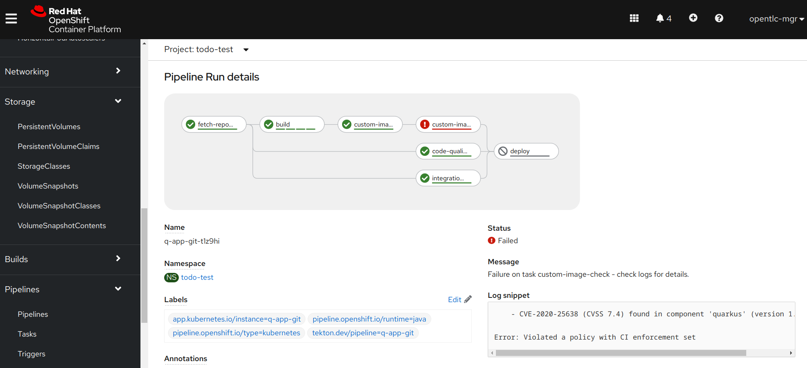
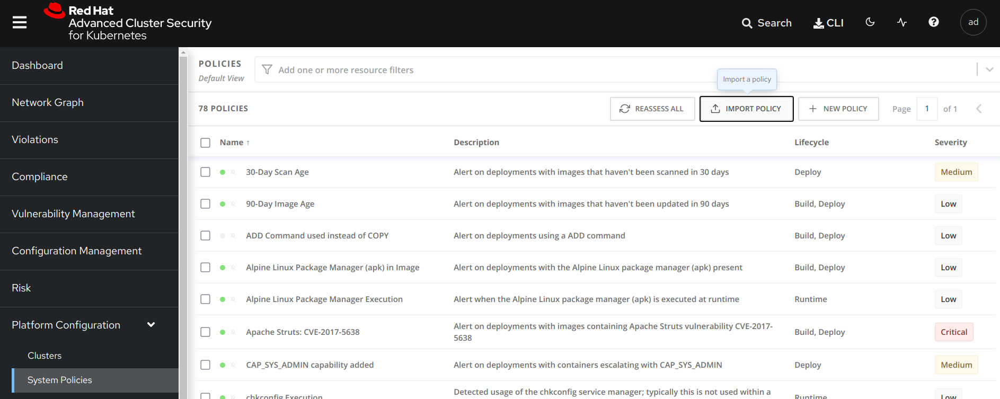
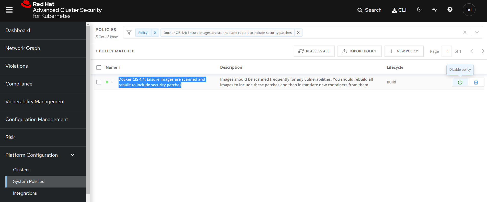
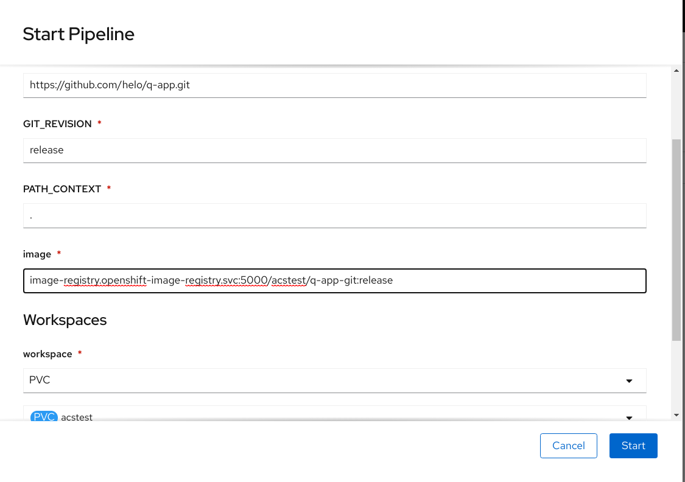
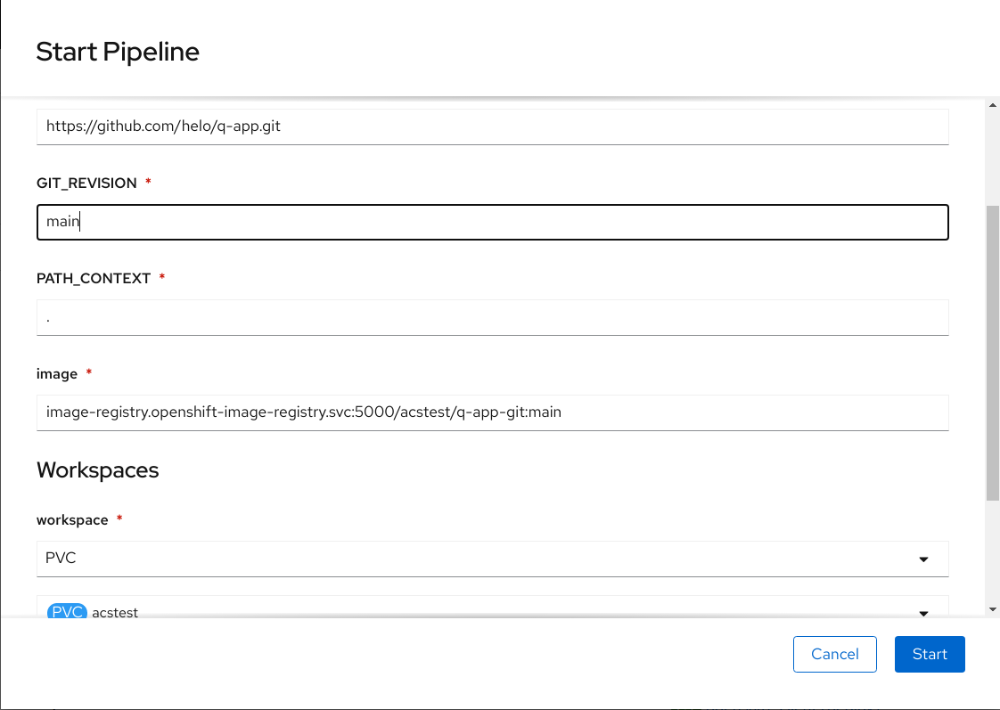

# Multi-product demo: OpenShift, Tekton, RHACS and Quarkus
This is a simple demonstration of building a Quarkus application using Tekton in OpenShift 4.6 and integrating the pipeline to Red Hat Advanced Cluster Security (ACS/RHACS).

The demo displays detection of a vulnerability (CVE-2020-25638: hibernate-core: SQL injection) in Quarkus 1.7.3.Final. Updating our build to Quarkus 1.11.6.Final, we can see how our build now passes scanning and how the build gets deployed.



* Provision OCP4 ACS cluster
* Run below commands to setup the demo

```
oc login ...
git clone https://github.com/RedHatBelux/rhacs-demo
cd rhacs-demo
oc create namespace acstest
oc project acstest
oc import-image quarkus/ubi-quarkus-native-s2i --from=quay.io/quarkus/ubi-quarkus-native-s2i:20.1.0-java11 --confirm
oc new-app --name=q-app-git quay.io/quarkus/ubi-quarkus-native-s2i:20.1.0-java11~https://github.com/tqvarnst/q-app.git
oc cancel-build bc/q-app-git  
oc patch bc/q-app-git -p '{"spec":{"resources":{"limits":{"cpu":"4", "memory":"4Gi"}}}}'
oc start-build q-app-git
oc create -f custom-image-check.yaml
oc create -f custom-image-scan.yaml
oc create -f pipeline-pv.yaml
oc create -f integration-test.yaml
oc create -f code-quality-analysis.yaml
oc create -f sign-image.yaml
oc create -f quarkus-pipeline.yaml
```

* We need to add the right secrets for the roxctl commands used in our pods:
  * Navigate to the StackRox portal.
  * Go to Platform Configuration > Integrations.
  * Scroll down to the Authentication Tokens category, and select API Token.
  * Select Generate Token.
  * Enter a name for the token and select a role that provides the required level of access, in this case Continuous Integration.
  * Select Generate
  * Copy the generated token and paste the base64 encoded token into the `roxsecrets.yaml` file by replacing `BASE64_API_TOKEN`.
  * Copy the base64 encoded central FQDN (Example: `central-stackrox.apps.ocp4.redhat.arrowlabs.be:443` base into the `roxsecrets.yaml` file by replacing `BASE64_ENDPOINT_INCLUDING_PORT_443`.
    * Reminder: You can encode both the API Token and the FQDN by using the command `base64`. Example with the FQDN `echo -n 'central-stackrox.apps.ocp4.redhat.arrowlabs.be:443' | base64`.
  * `oc create -f roxsecrets.yaml`

* Create ACS policy from acs_quarkus_policy.json which will detect an issue in the built image via the RHACS web console.


* Disable the "Red Hat Package Manager in Image", "FIXABLE CVSS >= 7" and "Docker CIS 4.4: Ensure images are scanned and rebuilt to include security patches" policies. For demo purposes, as we want a clean pass by just fixing one single thing.


* PREP/fixme: Currently before doing the demo, once, you need to run the pipeline with the IMAGE tag removed.

* Run a pipeline that fails. By setting GIT_REVISION to `release` and IMAGE to q-app-git:release, we will build our Quarkus app based Quarkus 1.7.3.Final. CVE-2020-25638 is not fixed in this image, which will show in the scan of the built image.


* Run a pipeline that passes scanning. By changing GIT_REVISION to `main` and IMAGE to q-app-git:main, we will build our Quarkus app based on Quarkus 1.11.6.Final which contains the fix for CVE-2020-25638, causing the scan to pass and the app to deploy.

